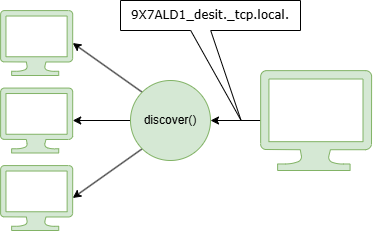
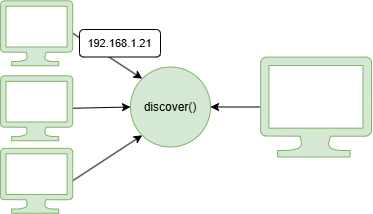
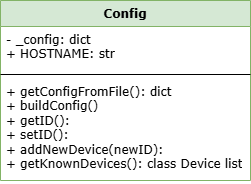
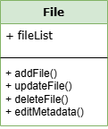
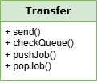

<h1 align="center"> </h1>

Merkezi bilgisayarlara bağlı kalmadan yerel ağdaki bilgisayarlar için dosya eşitleme düzeneği.

File synchronization system for computers that on same local network without being dependant to a central/remote computer/server.

<!-- markdownlint-configure-file { 
  "no-inline-html": {
    "allowed_elements": [
        "h1",
        "u",
        "br",
        "img",
    ]
  }
} -->

## Sistemler

Programın işleyişinde, programın çalıştığı makine (ana makine, `Host`
veya kullanılan makine) ve eklenen *diğer* aygıtlar (`Device`) olmak
üzere iki ana sınıf bulunuyor. `Host` sınıfı ile yeni aygıtların
eklenmesi, yapılandırma arayüzü, dosyaların yönetilmesi ve aktarımı gibi
programın çalıştığı aygıtla ilgili işlemler yürütülüyor. `Device`
sınıfıyla ise eklenmiş aygıtlar ile iletişim işlemleri yapılıyor.

Dosya aktarımında `ssh` üzerinde çalışan `scp` protokolü
kullanılacaktır. Yazıda bahsedilen anahtar çiftleri `ssh`
anahtarlarıdır.

![[]{#fig:architecture label="fig:architecture"} Sistemin Genel
Şeması](img/architectual-design.png)

### Keşif Arayüzü

Aygıtların birbirlerinin güncel IP adreslerine erişimi bu arayüz
üzerinden gerçekleştirilecektir. Bu süreç üretilen anahtarlardan
türetilen bir kimlik numarası (`ID`) ile gerçekleştirilecektir. Bu
`ID`'ler ile yerel ağda her aygıt için bir `mDNS` kaydı oluşturulacak
böylece her makine istediği aygıtın IP adresini ilgili ID ile yapacağı
*DNS* sorgusu ile gerçekleştirebilecektir.

Bu sorgu işlemleri `Service` modülünün içindeki iki sınıf ile
gerçekleştirilir. `ServiceRegister` sınıfı kullanılan makinenin ID
numarasına bağlı olan mDNS'in kaydedilmesini sağlıyor. Bu sınıf
gösterildiği gibi `Host` ana sınıfının bir üyesidir.

##### `ServiceRegister` sınıfı

`register()` metodunu barındırır. Bu metot `Zeroconf` kütüphanesinden
yararlanarak yerel ağ üzerinde bir servis kaydı (*mDNS* kaydı)
oluşturur. Oluşturulan servis kaydı program kapanana kadar açık kalmaya
devam eder. Program kapanırken bu kaydın silinmesini sağlar.

![[]{#fig:service-register label="fig:service-register"} mDNS servis
kaydı](img/service-register.png){

##### `ServiceDiscover` sınıfı

`Device` sınıfının bir üyesidir. Bu sınıfın içerisinde `discover()`
metodu çalıştırılır. Yeni bir `Device` sınıfı oluşturulduğunda ya da
ilgili aygıtın *güncel* IP adresi bulunmak istediğinde bu metot ID ile
türetilen bir *domain* sorgusu yapar.

<figure id="fig:service-discover">
<figure id="fig:service-discover-1">

<figcaption aria-hidden="true"><span id="fig:service-discover-1"
label="fig:service-discover-1"></span></figcaption>
</figure>
<figure id="fig:service-discover-2">

<figcaption aria-hidden="true"><span id="fig:service-discover-2"
label="fig:service-discover-2"></span></figcaption>
</figure>
<figcaption>mDNS servis sorgusu</figcaption>
</figure>

### Eşleşme Arayüzü

Eşleşme işlemi ile bir aygıt tarafından eklenen başka bir aygıtın bu
ekleme işleminden haberdar edilir ve anahtar takası gerçekleştirilir.
Eşleşme arayüzü için iletişim arayüzündeki *Reply-Request* (Bölüm
[1.3.2](#rep-req){reference-type="ref" reference="rep-req"}) metotları
kullanılacaktır.

![[]{#fig:key-exchange label="fig:key-exchange"} Anahtar
Takası](img/key-exchange.png){
### İletişim Arayüzü

Aygıtların iletişimi `Host` ve `Device` sınıfı içerisindeki farklı
metotlarla gerçekleştirilir. Bu metotlar `Messagging` modülüyle
oluşturulan mesajları kullanır.

#### Mesajlaşma Arayüzü

Tüm iletileşme işlemleri genişletilebilir olmasından ötürü `json`
biçimlendirmesinde olacaktır. Mesajların Python `dict` türünde
oluşturulması için `Messaging` sınıfı kullanılacaktır. Bu sınıf ilgili
anahtar değerlerini gönderici-alıcı makineye ve mesajın türüne uygun
olarak `toDict()` metoduyla oluşturur.

##### Mesaj şablonu

```python
{
    "TYPE" : "REQ::PUB_KEY",
    "TO" : "{DEVICE_ID}",     # or IDs [ "{DEV_ID-0}", "{DEV_ID-1}", ...]
    "FROM" : "{HOST_ID}",
    "HOSTNAME" : "{HOSTNAME}",
    "PUB_KEY": "ecdsa AvX...JmK lab@192...2" # HOST PUB_KEY
}       
```

#### Request-Reply {#rep-req}

Aygıtların arasında uçtan uca (*peer to peer*) bir iletişim gerektiğinde
`Host` ve `Device` sınıflarından bulunan `rep()` ve `req()` metotları
kullanılır.

##### `Host` sınıfı

`rep()` metodunu barındırır. Programın başlangıcıyla birlikte bu metot
çalıştırılır. Önceden belirtilen yapısal mesajlaşma şablonları ile gelen
mesajın `TYPE` değerine göre gerekli fonksiyonun yürütülmesini sağlar.

Örneğin bağlanan bir aygıttan gelen *umumi anahtar* isteğini aygıtın
`addNewDevice()` kaydedilmesi sağlayacak ve yerel makinenin umumi
anahtarı ile yanıtlayacaktır.

##### `Device` sınıfı

`req()` metodunu barındırır. Bu metoda verilen ilgili istek argümanına
göre nesnenin bağlı olduğu aygıta mesaj gönderilir. Yanıtı geri döndürür
ya da istek ile ilgili fonksiyonu çağırır.

Örneğin bir aygıtın *umumi anahtarına* ihtiyaç olduğunda `req()` metodu
ile mesaj gönderilecek ve yanıta göre işlem gerçekleştirilecektir.

#### Publisher-Subscriber

Her aygıtın dosya değişiklikleri, bağlantı durumları gibi bilgileri
yayınladığı bir yayın kanalı (`PUB`) vardır. Bu yayın kanalları `pub()`
metodu ile oluşturulur ve yönetilir. Programın çalışma süresince açık
kalacaktır. Eşleşilen aygıtların yayın kanallarına `sub()` metodu ile
bağlanılır.

##### `Host` sınıfı

dosya değişiklikleri ve bağlantı durumu gibi işlemleri yayınlayacak olan
`pub()` metodunu barındırır. Programın başlangıcıyla birlikte `pub()`
metodu çalışmaya başlar. Bu metot programın icra süresinde gerçekleşen
dosya ekleme/güncelleme değişikliklerini ve bağlantının kapanması
durumunu kendisine bağlanan (`SUB` olan) aygıtlara bu kanal üzerinden
iletir.

![[]{#fig:pub-sub label="fig:pub-sub"} PUB-SUB
Şeması](img/pub-sub-pattern.png)

Örneğin programın kullanıcı tarafından kapatılması durumunda `pub()`
metodu ile yayınlanan bir `disconnect` mesajı ile diğer aygıtlar bu
durumdan haberdar edilir. Eklenmiş dosya ile ilgili bilgiler bu dosyanın
paylaşıldığı aygıtlara bu metot ile paylaşılır.

##### `Device` sınıfı

eşleşilen aygıtların yayın kanalına bağlanılmasını sağlayan `sub()`
metodunu barındırır. Gelen iletileri değerlendirir ve buna göre işlemin
gerçekleştirilmesine karar verir.

### Aktarım Arayüzü

Yeni eklenen ya da değişiklik yapılan dosyaların aktarılması `Transfer`
sınıfındaki metotlar ile yapılır. Yapılacak işlemden önce `Host`
sınıfındaki `jobQueue` denetlenir ve bundan sonra dosyaya sahip olan
diğer aygıtlara ilgili dosyanın gönderilmesi sağlanır. Dosya
gönderiminde `Paramiko` kütüphanesindeki `scp` işlevlerinden
yararlanılacaktır.

### Alt Sistemler

### Yapılandırma Sistemi

Sistem ile ilgili tüm bilgiler bir yapılandırma dosyasına kaydedilir. Bu
işlemler `Config` sınıfı aracılığıyla gerçekleştirilir. Daha önce
eşleşilmiş aygıtların kimlik numaraları (`ID`) ve *umumi anahtarları*
gibi bilgiler yapılandırma dosyasının içine kaydedilir. Program
başlangıcında bu dosyanın varlığı yoklanır. Kaydedilmiş bilgiler
`Config` arayüzü ile dosyadan okunur. Program çalışırken eklenen
bilgiler yine bu arayüz ile yapılandırma dosyasına kaydedilir.

### Dosya Arayüzü

Dosyaları veritabanına ekleme, güncelleme, düzenleme gibi işlemler
`File` sınıfı içindeki metotlar ile gerçekleştirilir. Dosyaların hash
değerlerinin hesaplanması ve *dağıtık hash tablosunun* düzenlenmesi yine
bu arayüzle yapılır.

### Sınıf Tanımları

### Host

Programın çalıştırıldığı makineyle ilgili gerekli tüm bilgiler ve
metotlar bu sınıf altında bulunmaktadır.

![[]{#fig:host-dev-uml label="fig:host-dev-uml"}Host&Device sınıfı UML
Şeması](img/host-device-uml-diagram.png)

##### `getLocalIP()`

Kullanılan makinenin yerel IP adresini geri döndürür.

##### `getPubKey()`

Varsayılan bir dizinde kullanılan makinenin *umumi anahtarını* yoklar.
Eğer dosya yoksa dosyayı bu dizinde oluşturur.

##### `getIDFromConfig()`

Yapılandırma arayüzünü kullanarak yapılandırma dosyasından ID değerini
okur ve geri döndürür.

##### `addNewDevice(newID)`

Yeni bir aygıt eklenmesi için gerekli işlem ardışıklığını yürütür. Bir
`Device` nesnesi oluşturur. Bu aygıtın aynı zamanda yapılandırma
arayüzüyle dosyaya kaydedilmesini sağlar.

#### Config

Host sınıfının yapılandırma dosyası üzerinde yapacağı değişiklikler ve
bu bilgilerin okunması için kullandığı arayüz sınıfıdır.

##### `getConfigFromFile()`

Yapılandırma dosyasını varsayılan bir dizin içinde arar. Dosya bulunursa
bu dosyayı *Python* `dict` türünde bir nesneye dönüştürerek `_config`
üye değişkenine atar. Dosya dizinde yoksa ya da dizin yoksa duruma göre
dizini ve dosyayı oluşturur. Dosyayı oluşturmak için `buildConfig()`
metodunu çağırır.

##### `buildConfig()`

Yapılandırma dosyası yoksa bir `dict` nesnesi oluşturarak içini
kullanılan aygıtın bilgileri ile doldurur ve yapılandırma dosyasının
içerisine yazar.

##### `getID()`

Yapılandırma dosyasının `dict` biçiminde kopyası olan `_config` üye
değişkeninden ID'nin alınmasını sağlar.

##### `setID()`

`_config` üye değişkeni içindeki ID değerini değiştirir ve bu
değişikliğin yapılandırma dosyasına yazar.

##### `addNewDevice(newID)`

Eklenen aygıtların yapılandırma dosyası içine eklenmesini sağlar.

##### `getKnownDevices()`

Yapılandırma dosyasındaki eklenmiş aygıtların için birer `Device`
*instance*'ı oluşturur. Bu nesnelerin hepsini bir listeye ekler ve bu
listeyi geri döndürür.

<figure id="fig:uml">
<figure id="fig:config-uml">

<figcaption><span id="fig:config-uml"
label="fig:config-uml"></span>Config sınıfı</figcaption>
</figure>
<figure id="fig:file-uml">

<figcaption><span id="fig:file-uml" label="fig:file-uml"></span>File
sınıfı</figcaption>
</figure>
<figure id="fig:file-uml">

<figcaption><span id="fig:file-uml" label="fig:file-uml"></span>Transfer
sınıfı</figcaption>
</figure>
<figcaption>UML şemaları</figcaption>
</figure>

#### File

Dosyaların güncellenmesi, eklenmesi, *metaverilerinin* okunması gibi
işlemleri gerçekleştirir. Bunun için `addFile()`, `updateFile()`,
`deleteFile()` ve `editMetadata()` metotlarını kullanır.

#### Transfer

Eklenen dosyaların ilişkili olduğu aygıtlara aktarılmasını sağlar.
Aktarımı yapmadan önce `Host` sınıfının içindeki `jobQueue` kuyruğunu
yoklar. Aktarım için çakışan herhangi bir iş yoksa eylem
gerçekleştirilir. Bunun için `send()`, `checkQueue()`, `pushJob()` ve
`popJob()` metotlarını kullanır.

### Device

Her eklenen aygıtın bilgileri bir `Device` *instance*'ı içerisinde
saklanır. `Device` sınıfı aygıtlar ile iletişim için gerekli metotları
barındırır.

##### `discoverAddr()`

Güncel IP adresini bulmak için kullanılır. `ServiceDiscover` arayüzünü
kullanarak ID üzerinden bir DNS sorgusu yapılmasını sağlar. Eğer aygıt
çevrim içi ise güncel IP adresi geri döner.

##### `req(msg)`

Argüman verilen iletiyi (`msg` parametresi) *request* olarak aygıta
gönderir. Yanıtı geri döndürür. Bu metot gönderimden önce
`discoverAddr()` metodunu çağırarak IP adresini günceller.

##### `sub()`

Aygıtın yayın kanalına (`PUB`) bağlanılmasını sağlar. Gelen mesajların
türüne göre gerekli fonksiyonları çağırır. Programın işleyişinde her
aygıt için eş zamanlı olarak bir `sub()` işlevi yürütülür.

### Service

![[]{#fig:service-uml label="fig:service-uml"}Service sınıfı UML
Şeması](img/service-uml-diagram.png)
*Service* modülü iki ayrı sınıf tanımından oluşmaktadır. Bu iki sınıf
`Service` adlı sınıftan türetilmiştir.

##### `ServiceRegister`

Programın çalıştığı makinenin ID'si, adresi, portu ve adı (*hostname*)
gibi bilgileri içerir. `register()` metodunu kullanarak yerel ağda bir
*mDNS* kaydı oluşturur. Program durdurulunca bu kaydın silinmesini
sağlar. Bu sınıf `Host` sınıfının bir üyesidir.

##### `ServiceDiscover`

Verilen aygıt ID'sine göre bir mDNS sorgusu yapan `discover()` metodunu
barındır. Bu metot ağdaki tüm servisleri tarar. Verilen ID ile eşleşen
IP adresini geri döndürür.

### Rutin ve Arayüz Tanımları

Program tüm kullanıcı işlevlerini ve kayıtları gösteren tek bir pencere
üzerinden yönetilir. Kullanılan makine hakkındaki bilgiler ve kayıtlar
burada gösterilir. Yeni aygıt ve dosya ekleme işlemleri bu pencere
üzerindeki düğmeler ile yürütülür.

![[]{#fig:ui-prototype label="fig:ui-prototype"} Kullanıcı Arayüzü
Prototipi](img/ui-prototype.png)

##### Yeni aygıt ekleme

düğmesi ile kullanıcıya eklenecek aygıtın ID'sini girebileceği bir istem
kutucuğu açılır. Girilen ID ile daha önce bahsedilen `addNewDevice()`
işlevi çağırılır.

##### Yeni dosya ekleme

düğmesi ile kullanıcı için bir dosya penceresi (*file dialog*) açılır.
Dosya seçildikten sonra eklenmiş aygıtlardan hangileriyle dosyanın
paylaşılacağı kullanıcıya sorulur. Seçilen dosyanın yolu ve seçilen
aygıtlar `File` sınıfının `addNewFile()` metoduna argüman olarak
verilir.

### Kütüphaneler ve Standartlar

-   Program Python ile yazılacaktır.
-   Programın uçtan uca (*peer to peer*) iletileşme işlemlerinde
    `ZeroMQ`[^1] kütüphanesinden yararlanılacaktır.
-   Dosya aktarımı için `ssh` protokolü altında çalışan `scp` protkolü
    kullanılacaktır.
    Bu protkolü kullanmayı sağlayan `Paramiko`[^2] kütüphanesinden
    yararlanılacaktır.
-   PEP8 Python Kodlama Standardı[^3] kullanılacaktır.
-   Sabit üye değişkenler büyük harfle adlandırılacaktır.
-   Her sınıf modüllere ayrılacaktır.
-   Fonksiyonlar adlarına uygun olarak küçük görevlere bölünecektir.

### Test Yaklaşımları

-   Birim Testleri: Kullanıcı kaydı, giriş ve dosya yükleme modülleri
    için `pytest`[^4] ve `unittest`[^5] kullanılacaktır.
-   Dosya ve aygıt ekleme özellikleri elle test edilecektir.


[^1]: [zeromq.org](https://zeromq.org/)
[^2]: [paramiko.org](https://www.paramiko.org/)
[^3]: [peps.python.org](https://peps.python.org/pep-0008/)
[^4]: [pytest.org](https://docs.pytest.org/en/stable/getting-started.html)
[^5]: [docs.python.org#unittest](https://docs.python.org/3/library/unittest.html)
